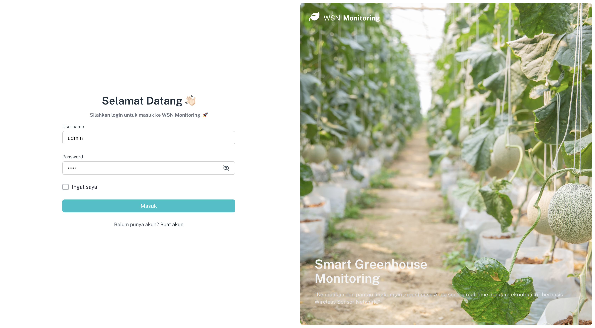

🌱 AIoT Wireless Sensor Network iClimate in Greenhouse with LSTM & Reinforcement Learning

Overview
iClimate is an intelligent greenhouse climate management system that leverages AIoT (Artificial Intelligence of Things), LSTM deep learning, and Reinforcement Learning (RL) to create a fully autonomous and energy-efficient environment for crop cultivation.

By deploying a wireless sensor network, the system continuously gathers real-time data on key environmental variables such as temperature, humidity, and CO₂ levels. These data points are then fed into an LSTM-based model to accurately forecast future conditions. The RL algorithm dynamically adjusts actuators (like fans, heaters, humidifiers) to maintain optimal growing conditions — minimizing energy use while maximizing plant growth and yield.

🔧 Key Features
AIoT Wireless Sensor Network for real-time environmental monitoring

LSTM Prediction Model for accurate climate forecasting

Reinforcement Learning (RL) for smart and adaptive climate control

Energy-efficient and Autonomous greenhouse management

Scalable Architecture suitable for various greenhouse sizes

🌿 Benefits
Improved crop yield through optimal microclimate control

Reduced energy and water consumption

Fully automated decision-making with minimal human intervention

Scalable for industrial and personal farming needs

